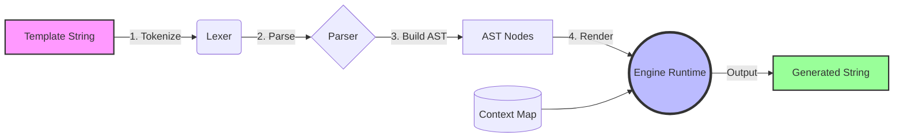

<div align="center">
  
  <h1>MoonTemplate</h1>
  <p>A lightweight, flexible, and extensible text template engine designed exclusively for <b>MoonBit</b>.</p>

  <p>
    
    
    
    
  </p>
</div>

## 📖 Introduction
**MoonTemplate** is a highly extensible text templating engine built from scratch natively in MoonBit. Designed for high performance and strict type safety, it provides developers with a robust tool to generate dynamic content, ranging from HTML pages and emails to source code generation.

## ✨ Key Features
- **Zero Dependencies**: Pure MoonBit implementation, incredibly lightweight.
- **Robust Parsing Engine**: Custom-built Lexer and AST Parser ensuring 100% safety and speed.
- **Variable Interpolation**: Effortlessly inject dynamic context data (`{{ variable }}`).
- **Control Flow**: Complex conditional rendering logic supported natively (``).
- **Iteration (For Loops)**: Full support for array and list iteration (``).
- **Extensible Filter System**: Chainable architecture via pipes (`{{ name | uppercase | trim }}`).
- **CLI Ready**: Seamlessly render templates directly from your terminal.

## 🏗️ Architecture Design

MoonTemplate's compiler-like architecture ensures high cohesion and extreme extensibility.



## 🚀 Quick Start

### Installation
Publishing to `mooncakes.io` enables you to add it via `moon add`:
```bash
moon add Project2026-creator/moontemplate
```

### Basic Variable Rendering
```moonbit
let template = "Hello, {{ user }}! Welcome to MoonBit."
let engine = Engine::new(template).unwrap()
let ctx = Map::new()
ctx.set("user", "Hero001")

let output = engine.render(ctx)
println(output) // Output: Hello, Hero001! Welcome to MoonBit.
```

### Using Conditionals & Loops
```moonbit
let template = 
  #|
  #|Welcome Admin! Users:
  #| - {{ u }}
  #|

let engine = Engine::new(template).unwrap()
// Setup your context variables here...
```

### Filters
```moonbit
let template = "Current status: {{ status | uppercase }}"
let engine = Engine::new(template).unwrap()
engine.register_filter("uppercase", fn(s) { s.to_upper() })
```

## 🛠️ CLI Usage
MoonTemplate includes a robust CLI tool for rendering template files directly from your terminal, completely decoupled from your application code.
```bash
moon run src/cli -- template.txt
```

## 🤝 Contributing
Contributions make the open-source community an amazing place! Please see `CONTRIBUTING.md` for details on how to contribute, build, and test the project. All PRs should pass standard `moon test` validation.

## 📄 License
This project is officially licensed under the **Apache 2.0 License** - see the `LICENSE` file for details.
